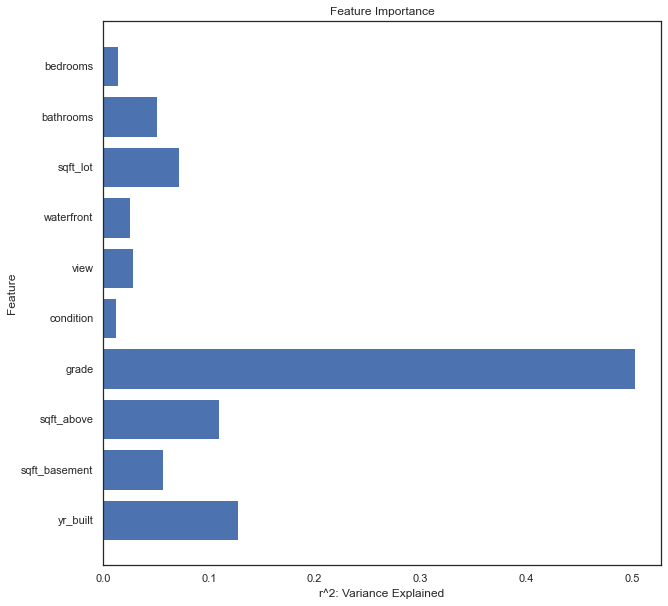
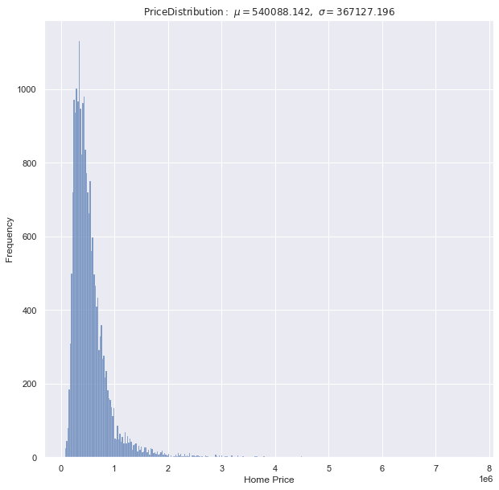

#### Train: Random Forest r2:  0.9634

#### Test : Random Forest r2 :  0.7259

These features go unused in this model

-   **date**: Outside of the scope of this study. Is factor of environment and not home
-   **sqft_living**: Sum of sqft_above and sqft_basement, so those 2 already contain sqft_living
-   **floors**: Number of floors is already contained in sqft_living
-   **yr_renovated**: Most entries will have zero value because those homes are not renovated
-   **lat[titude], long[itude], zipcode, date**: Miniscule variation in these features in this localed dataset

Most homes cost under $1mm, but there are some that extend into the multimillion.
Price skews to the right